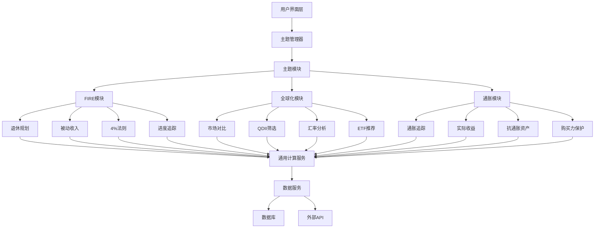

# 主题功能模块结构文档

## 模块概述

"基你太美"系统采用主题化设计，为不同投资理念的用户提供个性化的功能体验。系统包含三大核心主题，每个主题都有专属的功能模块和分析视角。

## 主题架构设计

### 主题分类体系

```
投资主题体系
├── 🏖️ 提前退休 (FIRE Theme)
│   ├── 退休规划模块
│   ├── 被动收入分析模块
│   ├── 4%法则验证模块
│   └── FIRE进度追踪模块
├── 🌍 这还是国内吗 (Global Theme)
│   ├── 全球市场对比模块
│   ├── QDII产品筛选模块
│   ├── 汇率影响分析模块
│   └── 全球ETF推荐模块
└── 💰 跑赢通胀 (Inflation Theme)
    ├── 通胀实时追踪模块
    ├── 实际收益计算模块
    ├── 抗通胀资产分析模块
    └── 购买力保护模块
```

## 主题功能模块详细设计

### 🏖️ 提前退休主题 (FIRE Theme)

#### 1. 退休规划模块 (RetirementPlanningModule)

**功能描述**：帮助用户制定和跟踪退休计划，计算实现财务自由所需的投资目标和策略。

**核心组件**：
```
RetirementPlanning/
├── components/
│   ├── RetirementCalculator.vue      # 退休目标计算器
│   ├── GoalSetting.vue              # 目标设置组件
│   ├── TimelineChart.vue            # 时间轴图表
│   └── ProgressTracker.vue          # 进度追踪器
├── services/
│   ├── retirementCalculator.js       # 退休计算服务
│   ├── goalManager.js               # 目标管理服务
│   └── projectionEngine.js          # 预测引擎
├── utils/
│   ├── financialFormulas.js         # 财务计算公式
│   └── assumptions.js               # 预设假设
└── types/
    └── retirement.d.ts              # 类型定义
```

**主要功能**：
- 退休年龄和目标金额计算
- 基于当前资产和储蓄计划的退休可行性分析
- 不同投资策略下的退休时间预测
- 退休后的资金可持续性验证

**数据流**：
```
用户输入目标 → 计算引擎生成方案 → 展示预测结果 → 用户调整参数 → 重新计算
```

#### 2. 被动收入分析模块 (PassiveIncomeModule)

**功能描述**：计算和分析用户投资组合的被动收入生成能力，评估覆盖生活支出的能力。

**核心组件**：
```
PassiveIncome/
├── components/
│   ├── IncomeCalculator.vue         # 收入计算器
│   ├── CoverageAnalyzer.vue         # 覆盖率分析器
│   ├── IncomeChart.vue              # 收入构成图表
│   └── ProjectionModel.vue          # 预测模型
├── services/
│   ├── incomeAnalyzer.js            # 收入分析服务
│   ├── coverageCalculator.js        # 覆盖率计算
│   └── dividendTracker.js           # 分红跟踪
└── utils/
    └── yieldCalculations.js         # 收益率计算
```

**主要功能**：
- 计算投资组合的年化被动收入
- 分析收入来源构成（分红、利息、租金等）
- 评估被动收入对生活支出的覆盖率
- 预测被动收入增长趋势

#### 3. 4%法则验证模块 (FourPercentRuleModule)

**功能描述**：验证用户资产是否符合经典的4%提取法则，评估退休资金的可持续性。

**核心组件**：
```
FourPercentRule/
├── components/
│   ├── RuleValidator.vue            # 法则验证器
│   ├── SustainabilityChart.vue     # 可持续性图表
│   ├── WithdrawalSimulator.vue      # 提取模拟器
│   └── HistoricalTest.vue           # 历史回测
├── services/
│   ├── ruleValidator.js             # 法则验证服务
│   ├── withdrawalSimulator.js       # 提取模拟服务
│   └── historicalBacktest.js        # 历史回测服务
└── data/
    └── marketReturns.js             # 市场收益数据
```

**主要功能**：
- 验证当前资产是否符合4%提取法则
- 不同提取比例的可持续性分析
- 基于历史数据的成功率计算
- 个性化提取策略建议

#### 4. FIRE进度追踪模块 (FIREProgressModule)

**功能描述**：实时追踪用户朝着财务自由目标的进度，提供进度可视化。

**核心组件**：
```
FIREProgress/
├── components/
│   ├── ProgressDashboard.vue       # 进度仪表盘
│   ├── MilestoneTracker.vue        # 里程碑追踪
│   ├── ProgressBar.vue             # 进度条
│   └── AchievementBadges.vue        # 成就徽章
├── services/
│   ├── progressTracker.js          # 进度跟踪服务
│   ├── milestoneManager.js         # 里程碑管理
│   └── achievementEngine.js        # 成就引擎
└── constants/
    └── milestones.js               # 里程碑定义
```

**主要功能**：
- 实时显示FIRE目标完成进度
- 设置和追踪中间里程碑
- 成就系统和激励机制
- 进度历史记录和趋势分析

### 🌍 这还是国内吗主题 (Global Theme)

#### 1. 全球市场对比模块 (GlobalMarketComparisonModule)

**功能描述**：对比分析不同国家和地区的市场表现，帮助用户了解全球投资机会。

**核心组件**：
```
GlobalMarketComparison/
├── components/
│   ├── MarketComparisonChart.vue    # 市场对比图表
│   ├── RegionalPerformance.vue     # 区域表现
│   ├── CurrencyAdjustedReturns.vue  # 汇率调整收益
│   └── CorrelationMatrix.vue       # 相关性矩阵
├── services/
│   ├── marketDataFetcher.js         # 市场数据获取
│   ├── returnCalculator.js          # 收益计算器
│   └── correlationAnalyzer.js       # 相关性分析
└── data/
    ├── globalIndices.js            # 全球指数数据
    └── currencyRates.js            # 汇率数据
```

**主要功能**：
- 对比A股、美股、港股等主要市场表现
- 计算考虑汇率影响后的实际收益
- 分析不同市场的相关性和风险分散效果
- 提供全球资产配置建议

#### 2. QDII产品筛选模块 (QDIIScreeningModule)

**功能描述**：帮助用户筛选和比较QDII基金产品，了解海外投资机会。

**核心组件**：
```
QDIIScreening/
├── components/
│   ├── ProductFilter.vue           # 产品筛选器
│   ├── QuotaMonitor.vue            # 额度监控
│   ├── ProductComparison.vue       # 产品对比
│   └── RecommendationEngine.vue    # 推荐引擎
├── services/
│   ├── qdiiDataService.js          # QDII数据服务
│   ├── quotaTracker.js             # 额度跟踪
│   ├── productAnalyzer.js          # 产品分析
│   └── recommender.js              # 推荐算法
└── utils/
    └── screeningCriteria.js        # 筛选标准
```

**主要功能**：
- 按投资区域、资产类型、费率等筛选QDII产品
- 实时监控QDII额度和使用情况
- 产品对比和评价系统
- 基于用户持仓的个性化推荐

#### 3. 汇率影响分析模块 (CurrencyImpactModule)

**功能描述**：分析汇率变化对海外投资收益的影响，提供汇率风险管理建议。

**核心组件**：
```
CurrencyImpact/
├── components/
│   ├── ExchangeRateChart.vue       # 汇率图表
│   ├── ImpactAnalyzer.vue          # 影响分析器
│   ├── HedgingTools.vue            # 对冲工具
│   └── RiskAssessment.vue          # 风险评估
├── services/
│   ├── exchangeRateService.js       # 汇率服务
│   ├── impactCalculator.js         # 影响计算
│   ├── hedgingAdvisor.js           # 对冲建议
│   └── riskAssessor.js             # 风险评估
└── data/
    ├── exchangeRates.js            # 汇率数据
    └── currencyPairs.js            # 货币对数据
```

**主要功能**：
- 实时显示主要汇率走势
- 计算汇率变化对投资收益的影响
- 提供汇率对冲工具和建议
- 评估汇率风险敞口

#### 4. 全球ETF推荐模块 (GlobalETFRecommendationModule)

**功能描述**：基于用户持仓和风险偏好，推荐合适的全球ETF产品。

**核心组件**：
```
GlobalETFRecommendation/
├── components/
│   ├── ETFExplorer.vue             # ETF探索器
│   ├── RecommendationList.vue      # 推荐列表
│   ├── ETFComparison.vue           # ETF对比
│   └── AllocationOptimizer.vue     # 配置优化
├── services/
│   ├── etfDataService.js           # ETF数据服务
│   ├── recommendationEngine.js     # 推荐引擎
│   ├── portfolioOptimizer.js       # 组合优化
│   └── etfAnalyzer.js             # ETF分析
└── algorithms/
    ├── meanVarianceOptimizer.js    # 均值方差优化
    └── correlationAnalyzer.js      # 相关性分析
```

**主要功能**：
- 提供全球ETF产品数据库和筛选功能
- 基于现代投资组合理论的配置优化
- 与用户现有持仓的互补性分析
- 个性化ETF推荐和配置建议

### 💰 跑赢通胀主题 (Inflation Theme)

#### 1. 通胀实时追踪模块 (InflationTrackingModule)

**功能描述**：实时监控和预测通胀数据，帮助用户了解当前的通胀水平。

**核心组件**：
```
InflationTracking/
├── components/
│   ├── CPIChart.vue                # CPI图表
│   ├── InflationForecast.vue       # 通胀预测
│   ├── HistoricalTrends.vue        # 历史趋势
│   └── RegionalComparison.vue      # 地区对比
├── services/
│   ├── cpiDataService.js           # CPI数据服务
│   ├── inflationForecaster.js      # 通胀预测
│   ├── trendAnalyzer.js            # 趋势分析
│   └── regionalComparator.js       # 地区比较
└── data/
    ├── cpiData.js                  # CPI数据
    └── inflationForecast.js        # 通胀预测数据
```

**主要功能**：
- 实时显示CPI、PPI等通胀指标
- 提供专业的通胀预测和趋势分析
- 历史通胀数据对比和解读
- 不同地区和行业的通胀差异分析

#### 2. 实际收益计算模块 (RealReturnModule)

**功能描述**：计算扣除通胀后的实际收益率，评估投资的真实购买力增长。

**核心组件**：
```
RealReturn/
├── components/
│   ├── ReturnCalculator.vue        # 收益计算器
│   ├── RealReturnChart.vue         # 实际收益图表
│   ├── InflationAdjustment.vue     # 通胀调整
│   └── PurchasingPower.vue         # 购买力分析
├── services/
│   ├── returnCalculator.js         # 收益计算服务
│   ├── inflationAdjuster.js        # 通胀调整服务
│   ├── purchasingPowerAnalyzer.js  # 购买力分析
│   └── scenarioSimulator.js        # 情景模拟
└── utils/
    └── financialMath.js            # 金融数学工具
```

**主要功能**：
- 计算名义收益和实际收益的差异
- 长期通胀对投资收益的影响分析
- 不同通胀情景下的收益预测
- 购买力保护和增长策略建议

#### 3. 抗通胀资产分析模块 (InflationHedgingModule)

**功能描述**：分析各类资产抗通胀能力，推荐合适的抗通胀投资组合。

**核心组件**：
```
InflationHedging/
├── components/
│   ├── AssetAnalyzer.vue           # 资产分析器
│   ├── HedgingStrategy.vue         # 对冲策略
│   ├── PortfolioOptimizer.vue     # 组合优化
│   └── HistoricalPerformance.vue   # 历史表现
├── services/
│   ├── assetAnalyzer.js            # 资产分析服务
│   ├── hedgingAdvisor.js           # 对冲建议
│   ├── portfolioOptimizer.js       # 组合优化
│   └── performanceAnalyzer.js      # 表现分析
└── data/
    ├── inflationHedgingAssets.js   # 抗通胀资产数据
    └── historicalReturns.js       # 历史收益数据
```

**主要功能**：
- 分析黄金、房地产、大宗商品等抗通胀资产表现
- 构建优化的抗通胀投资组合
- 历史抗通胀效果回测和验证
- 基于市场环境的动态调整建议

#### 4. 购买力保护模块 (PurchasingPowerProtectionModule)

**功能描述**：帮助用户制定策略保护财富购买力，应对通胀风险。

**核心组件**：
```
PurchasingPowerProtection/
├── components/
│   ├── PowerCalculator.vue         # 购买力计算器
│   ├── ProtectionStrategy.vue      # 保护策略
│   ├── GoalTracker.vue             # 目标追踪
│   └── ScenarioPlanning.vue        # 情景规划
├── services/
│   ├── powerCalculator.js          # 购买力计算
│   ├── protectionStrategist.js      # 保护策略
│   ├── goalTracker.js              # 目标跟踪
│   └── scenarioPlanner.js          # 情景规划
└── utils/
    └── inflationCalculators.js     # 通胀计算器
```

**主要功能**：
- 计算不同通胀率下的购买力损失
- 制定个性化购买力保护策略
- 设定购买力保护目标和进度追踪
- 不同通胀情景下的应对方案

## 主题模块间的共享组件

### 通用工具组件

```
common/
├── components/
│   ├── BaseCalculator.vue          # 基础计算器组件
│   ├── ChartContainer.vue          # 图表容器
│   ├── DataTable.vue               # 数据表格
│   ├── FilterPanel.vue             # 筛选面板
│   └── ExportTools.vue             # 导出工具
├── services/
│   ├── dataService.js              # 数据服务基础类
│   ├── calculatorService.js        # 计算服务基础类
│   └── chartService.js             # 图表服务基础类
├── utils/
│   ├── formatters.js               # 数据格式化工具
│   ├── validators.js               # 验证工具
│   └── constants.js                # 常量定义
└── types/
    └── common.d.ts                 # 通用类型定义
```

### 数据集成层

```
data/
├── adapters/
│   ├── fundDataAdapter.js         # 基金数据适配器
│   ├── marketDataAdapter.js        # 市场数据适配器
│   └── economicDataAdapter.js      # 经济数据适配器
├── providers/
│   ├── dataProvider.js             # 数据提供者
│   ├── cacheProvider.js            # 缓存提供者
│   └── apiProvider.js              # API提供者
└── transformers/
    ├── dataTransformer.js          # 数据转换器
    └── chartTransformer.js         # 图表数据转换器
```

## 模块间依赖关系

### 依赖层次结构

```
┌─────────────────────────────────────────┐
│              表现层 (Presentation)        │
├─────────────────────────────────────────┤
│              业务逻辑层 (Business)        │
├─────────────────────────────────────────┤
│              数据服务层 (Data Service)    │
├─────────────────────────────────────────┤
│              数据访问层 (Data Access)      │
└─────────────────────────────────────────┘
```

### 模块依赖图



## 性能优化策略

### 1. 模块懒加载
```javascript
// 路由懒加载
const FIREModule = () => import('@/themes/fire/modules')
const GlobalModule = () => import('@/themes/global/modules')
const InflationModule = () => import('@/themes/inflation/modules')

// 组件懒加载
const RetirementCalculator = () => import('./components/RetirementCalculator.vue')
```

### 2. 数据缓存策略
```javascript
// 多级缓存
class ThemeDataCache {
  constructor() {
    this.memoryCache = new Map()
    this.redisCache = redis.createClient()
  }

  async getData(key) {
    // 先查内存缓存
    if (this.memoryCache.has(key)) {
      return this.memoryCache.get(key)
    }

    // 再查Redis缓存
    const cached = await this.redisCache.get(key)
    if (cached) {
      this.memoryCache.set(key, JSON.parse(cached))
      return JSON.parse(cached)
    }

    // 最后查数据库或API
    return null
  }
}
```

### 3. 计算优化
```javascript
// Web Worker处理复杂计算
class ThemeCalculationWorker {
  constructor() {
    this.worker = new Worker('/workers/theme-calculator.js')
  }

  async calculateMetrics(data, theme) {
    return new Promise((resolve) => {
      this.worker.postMessage({ data, theme })
      this.worker.onmessage = (e) => resolve(e.data)
    })
  }
}
```

## 测试策略

### 1. 单元测试
- 每个模块独立测试
- 重点关注计算逻辑准确性
- Mock外部依赖

### 2. 集成测试
- 模块间数据流测试
- 主题切换功能测试
- 性能基准测试

### 3. 端到端测试
- 用户完整使用场景测试
- 不同主题功能对比测试
- 浏览器兼容性测试

## 部署和维护

### 1. 模块化部署
- 支持独立部署主题模块
- 灰度发布新功能
- 快速回滚机制

### 2. 监控告警
- 模块性能监控
- 错误率监控
- 用户行为分析

### 3. 持续优化
- 基于用户反馈的功能迭代
- A/B测试验证改进效果
- 数据驱动的产品优化

这个主题功能模块结构为"基你太美"产品提供了清晰的架构指导，确保每个主题都能提供专业、个性化的投资工具和体验。